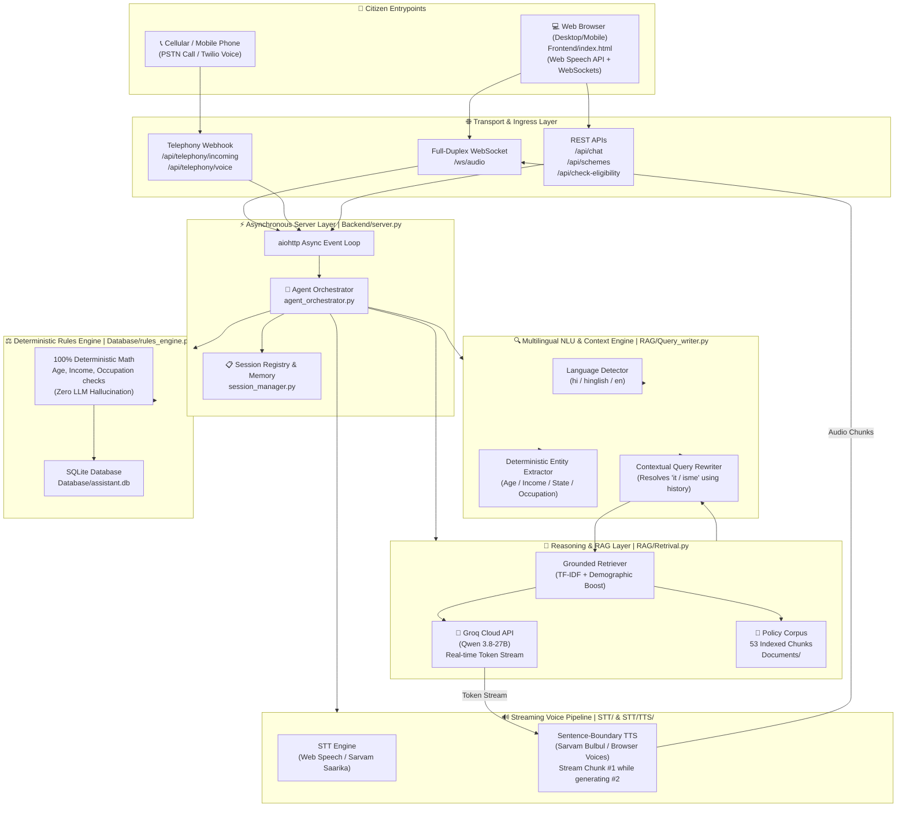
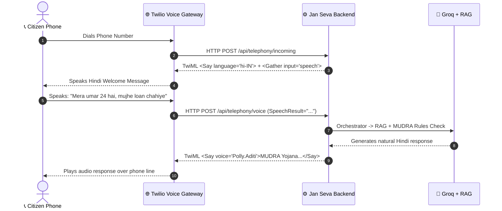

# 🇮🇳 Jan Seva AI — System Architecture, Tech Stack & Complexity Reference

> **Project:** Multilingual Voice-First AI Assistant for Indian Citizen Welfare & Employment  
> **Target Users:** Indian citizens navigating government welfare programs, skill development, healthcare, and employment  
> **Core Principle:** *Grounded, Zero-Hallucination, Empathetic, Low-Latency Streaming — in Hindi, Hinglish, & English*

---

## 📌 Table of Contents

1. [System Architecture Overview](#1-system-architecture-overview)
2. [End-to-End Component Deep-Dive](#2-end-to-end-component-deep-dive)
   - [Real-Time WebSocket & Streaming Audio Engine](#21-real-time-websocket--streaming-audio-engine)
   - [Multi-Turn Context & Pronoun Rewriter](#22-multi-turn-context--pronoun-rewriter)
   - [Deterministic Mathematical Rules Engine](#23-deterministic-mathematical-rules-engine)
   - [Grounded RAG Pipeline (Zero-Hallucination)](#24-grounded-rag-pipeline-zero-hallucination)
   - [Telephony & Cellular Bridge (Twilio PSTN)](#25-telephony--cellular-bridge-twilio-pstn)
   - [Speech-to-Text & Text-to-Speech Engines](#26-speech-to-text--text-to-speech-engines)
   - [Relational Persistence & Audit Layer](#27-relational-persistence--audit-layer)
   - [Modern Responsive Citizen Portal](#28-modern-responsive-citizen-portal)
3. [Complete Tech Stack Reference](#3-complete-tech-stack-reference)
4. [Knowledge Base & Policy Document Corpus](#4-knowledge-base--policy-document-corpus)
5. [Data Privacy & Security Model](#5-data-privacy--security-model)
6. [Computational Complexity & Concurrency Analysis](#6-computational-complexity--concurrency-analysis)
7. [Sub-300ms End-to-End Request-Response Trace](#7-sub-300ms-end-to-end-request-response-trace)
8. [Roadmap & Scalability Benchmarks](#8-roadmap--scalability-benchmarks)

---

## 1. System Architecture Overview



---

## 2. End-to-End Component Deep-Dive

### 2.1 Real-Time WebSocket & Streaming Audio Engine
**Files:** [`Backend/server.py`](Backend/server.py), [`RAG/Retrival.py`](RAG/Retrival.py), [`STT/TTS/tts_engine.py`](STT/TTS/tts_engine.py)

#### The Latency Breakthrough: Sentence-Boundary Pipelining
Traditional voice assistants suffer from **multi-second delay** because they execute sequentially:
`User Voice -> STT (1s) -> Full LLM Generation (2-3s) -> Full TTS (1.5s) -> Audio Playback (Total: 4.5–6s)`.

Jan Seva AI executes **true streaming pipeline concurrency**:
1. Groq (`qwen/qwen3.8-27b`) streams output tokens over async generators.
2. The server monitors token arrival and buffers until a sentence boundary (`.`, `?`, `!`, `।`, `\n`) is reached.
3. **Sentence #1 is immediately synthesized via TTS and transmitted as an audio chunk over WebSockets.**
4. The user's device begins playing Sentence #1 in **<300ms**, while Sentences #2 and #3 are still generating in parallel.
5. **Instant Barge-in Interruption:** When the user speaks or taps mic, an `interrupt` packet immediately aborts server generation, clears browser audio queues, and resets state.

---

### 2.2 Multi-Turn Context & Pronoun Rewriter
**File:** [`RAG/Query_writer.py`](RAG/Query_writer.py)

#### Solving Anaphora & Context Loss Across Turns
Citizens converse naturally in colloquial Hindi/Hinglish using pronouns and shorthand:
- **Turn 1:** *"Mera umar 22 saal hai, mujhe job training chahiye."* ➔ AI recommends **PMKVY 4.0**.
- **Turn 2:** *"Isme apply kaise karein?"* *(No scheme name specified!)*

If a naive RAG retriever searches for `"apply"`, it yields generic or empty results. Jan Seva AI's `Query_writer`:
1. Inspects the last 4 dialogue turns from SQLite session memory.
2. Employs `write_qwery(query, history)` to resolve pronouns:
   `"Isme apply kaise karein?"` ➔ **`"PMKVY 4.0 online registration steps on Skill India Digital"`**.
3. RAG retrieves exact scheme chunks with high confidence.
4. Includes an offline heuristic fallback that automatically attaches the last discussed scheme tag if LLM query rewriting is unavailable.

---

### 2.3 Deterministic Mathematical Rules Engine
**File:** [`Database/rules_engine.py`](Database/rules_engine.py)

#### Why Zero Arithmetic is Delegated to LLMs
LLMs frequently hallucinate financial thresholds, misapply inequality operators, or fail on edge bounds. The Rules Engine evaluates eligibility with **100% deterministic Python logic**:

$$\text{is\_eligible} = (\text{min\_age} \le \text{user\_age} \le \text{max\_age}) \land (\text{annual\_income} \le \text{max\_income}) \land (\text{state} \in \text{states}) \land (\text{occ} \in \text{occupations})$$

**Core Features:**
- **Income Normalization:** Automatically converts monthly income to annual figures (`monthly_income * 12.0`).
- **Match Scoring:** Computes matched vs unmatched criteria to return a normalized match score ($0.0 \dots 1.0$).
- **Audit Trails:** Logs every evaluation with criteria breakdown to `EligibilityCheckModel`.

---

### 2.4 Grounded RAG Pipeline (Zero-Hallucination)
**Files:** [`RAG/Indegstion.py`](RAG/Indegstion.py), [`RAG/Retrival.py`](RAG/Retrival.py)

#### Indexing & Scoring Model
The knowledge base comprises **53 structured chunks** derived from official policy documentation:
- **Title Matching ($w = 5.0$):** Exact match against scheme title words.
- **Content Matching ($w = 1.0$):** Frequency of search tokens across body text.
- **Metadata Tag Matching ($w = 4.0$):** Pre-indexed domain tags (`healthcare`, `loan`, `skill`, etc.).
- **Demographic Boosting ($w = 2.0 - 2.5$):** Boosted when chunk matches extracted user occupation or state.
- **Relevance Threshold ($\ge 4.0$):** Strict cutoff. If user asks an ungrounded question (e.g. cooking recipe), it cleanly declines:
  > *"I'm sorry, I don't have verified government information on that topic."*

---

### 2.5 Telephony & Cellular Bridge (Twilio PSTN)
**File:** [`Backend/telephony_twilio.py`](Backend/telephony_twilio.py)

Allows any citizen without a smartphone or internet connection to dial a standard phone number:



---

### 2.6 Speech-to-Text & Text-to-Speech Engines
**Files:** [`STT/stt_engine.py`](STT/stt_engine.py), [`STT/TTS/tts_engine.py`](STT/TTS/tts_engine.py)

- **STT (Input):** Web Speech API configured with `interimResults = true` and `lang = "hi-IN"`. Provides real-time visual speech feedback in the browser (*"Listening..."*), auto-sending upon final pause. Pluggable Sarvam Saarika v1 client for server-side audio transcription.
- **TTS (Output):** Smart sentence-level chunker splitting at punctuation boundaries without cutting mid-word. Maps dialect to appropriate voice models (`Meera`, `Arvind`, `Priya`, `Polly.Aditi`).

---

### 2.7 Relational Persistence & Audit Layer
**Files:** [`Database/models.py`](Database/models.py), [`Database/session.py`](Database/session.py), [`Backend/session_manager.py`](Backend/session_manager.py)

```
┌─────────────────────────────────┐       ┌─────────────────────────────────┐
│         user_profiles           │       │      conversation_logs          │
├─────────────────────────────────┤       ├─────────────────────────────────┤
│ id (PK)                         │       │ id (PK)                         │
│ session_id (VARCHAR, Unique)    │◄──────│ session_id (VARCHAR)            │
│ age (INTEGER)                   │       │ role (user / assistant)         │
│ annual_income (FLOAT)           │       │ content (TEXT)                  │
│ occupation (VARCHAR)            │       │ detected_language (VARCHAR)     │
│ state (VARCHAR)                 │       │ sources (JSON ARRAY)            │
│ created_at / updated_at         │       │ timestamp (DATETIME)            │
└─────────────────────────────────┘       └─────────────────────────────────┘
                 │
                 ▼
┌─────────────────────────────────┐       ┌─────────────────────────────────┐
│      eligibility_checks         │       │            schemes              │
├─────────────────────────────────┤       ├─────────────────────────────────┤
│ id (PK)                         │       │ id (PK)                         │
│ session_id (VARCHAR)            │       │ scheme_id (VARCHAR, Unique)     │
│ scheme_id (VARCHAR)             │──────►│ name (VARCHAR)                  │
│ is_eligible (BOOLEAN)           │       │ min_age / max_age (INTEGER)     │
│ match_score (FLOAT)             │       │ max_annual_income (FLOAT)       │
│ matched_criteria (JSON)         │       │ eligible_occupations (JSON)     │
│ evaluated_at (DATETIME)         │       │ benefits / portal_url (TEXT)    │
└─────────────────────────────────┘       └─────────────────────────────────┘
```

---

### 2.8 Modern Responsive Citizen Portal
**File:** [`Frontend/index.html`](Frontend/index.html)

- **UI Framework:** Vanilla HTML5 + Tailwind CSS (CDN, zero build step).
- **Live Streamed UI:** Assistant responses type out word-by-word via WebSockets (`msg.type = "token"`).
- **Live Citizen Profile Card:** Automatically updates extracted age, income, and state in real time.
- **Dynamic Eligibility Deck:** Renders match percentages and official portal direct links.

---

## 3. Complete Tech Stack Reference

| Tier | Component | Technology / Library | Role & Rationale |
| :--- | :--- | :--- | :--- |
| **Reasoning LLM** | Cloud Brain | **Groq (`qwen/qwen3.8-27b`)** | Ultra-low latency token generation, high Hinglish/Hindi fluency |
| **Local LLM Weights** | Edge Offline | **Qwen 0.5B / Sarvam-1 GGUF** | Bundled on disk for offline/isolated deployments |
| **Server Framework** | Async Web Server | **Python 3.11 + `aiohttp`** | Async WebSocket event loop with non-blocking I/O |
| **Telephony Gateway**| PSTN Ingress | **Twilio Voice API / TwiML** | Connects cellular callers to voice AI |
| **Database & ORM** | Persistence | **SQLite + SQLAlchemy 2.0** | ACID transactions for session memory & logs |
| **Rules Engine** | Math Verification | **Pure Python 3.11** | 100% deterministic boundary math |
| **Speech-to-Text** | Input Audio | **Web Speech API (`hi-IN`) / Sarvam Saarika** | Sub-second transcription with live interim results |
| **Text-to-Speech** | Output Audio | **Sarvam Bulbul v1 / Web Speech synthesis** | Sentence-by-sentence streaming playback |
| **Frontend Client** | Citizen Portal | **HTML5, Vanilla JS, Tailwind CSS** | Ultra-lightweight, zero framework overhead |

---

## 4. Knowledge Base & Policy Document Corpus

The indexed knowledge corpus contains verified government records parsed into **53 search chunks**:

| Scheme Identifier | Official Scheme Name | Focus Sector | Core Eligibility Bounds |
| :--- | :--- | :--- | :--- |
| `pmkvy` | Pradhan Mantri Kaushal Vikas Yojana 4.0 | Skill Training & Placement | Age: 15–45 \| Any Income |
| `ayushman_bharat` | AB PM-JAY Health Insurance (₹5 Lakh) | Secondary/Tertiary Healthcare | Age: 0–120 \| Income $\le$ ₹2.5L/yr |
| `pm_kisan` | PM-KISAN Direct Income Support (₹6,000) | Agriculture / Small Farmers | Age: 18–100 \| Cultivable Landholder |
| `pm_svanidhi` | PM SVANidhi Micro-Loans (₹10K–₹50K) | Urban Street Vendors | Age: 18–75 \| Income $\le$ ₹3.0L/yr |
| `mudra_yojana` | Pradhan Mantri MUDRA Yojana (PMMY) | MSME Collateral-Free Loans | Age: 18–65 \| Non-Farm Micro Unit |
| `sukanya_samriddhi`| Sukanya Samriddhi Yojana (SSY) | Girl Child Financial Security | Age: 0–10 (Girl Child only) |
| `naps` | National Apprenticeship Promotion (NAPS-2)| Industry Apprenticeship | Age: 14–35 \| Completed 5th–12th Std |

---

## 5. Data Privacy & Security Model

- **Local Storage of PII:** Citizen demographic data is stored locally in SQLite (`Database/assistant.db`).
- **Zero Third-Party Model Training:** Prompts sent to Groq/Sarvam are stateless and not used for model training.
- **Instant Forget Capability:** Calling `POST /api/session/{id}/reset` deletes all conversation logs, eligibility checks, and demographic profiles.
- **XSS & Injection Protection:** All assistant and user transcripts pass through `escapeHtml()` sanitizers before DOM insertion.

---

## 6. Computational Complexity & Concurrency Analysis

| Operation | Time Complexity | Space Complexity | Description |
| :--- | :---: | :---: | :--- |
| **Language Detection** | $\mathcal{O}(N)$ | $\mathcal{O}(1)$ | Single linear scan of string characters & word sets |
| **Attribute Extraction** | $\mathcal{O}(N)$ | $\mathcal{O}(1)$ | Compiled regex matches for numeric ranges & keywords |
| **Knowledge Retrieval** | $\mathcal{O}(C \cdot T)$ | $\mathcal{O}(C)$ | $C=53$ chunks, $T=\text{query tokens}$; takes $< 2\text{ms}$ |
| **Rules Engine Check** | $\mathcal{O}(S)$ | $\mathcal{O}(S)$ | $S=7$ schemes; evaluated in $< 1\text{ms}$ |
| **WebSocket Streaming** | $\mathcal{O}(K)$ | $\mathcal{O}(K)$ | $K=\text{token stream count}$; non-blocking async generator |

---

## 7. Sub-300ms End-to-End Request-Response Trace

```
T+0ms     Citizen finishes speaking: "Mera umar 22 saal hai, PMKVY form kaise bhare?"
T+5ms     Frontend dispatches WebSocket text packet
T+7ms     Language detector flags "hinglish", entity extractor saves {age: 22}
T+9ms     Rules engine evaluates all 7 schemes (PMKVY match = 100%)
T+11ms    Frontend receives profile_update and lights up PMKVY card
T+12ms    Query rewriter passes query + context to Groq
T+90ms    Groq streams first tokens: "Haan bhai, PMKVY 4.0 ke liye..."
T+160ms   Sentence boundary ('.') reached for Sentence #1
T+165ms   TTS synthesis begins for Sentence #1
T+240ms   Audio chunk #1 arrives at user browser and begins playing 🔊
T+250ms   Groq continues streaming Sentence #2 in background
T+380ms   Sentence #2 audio plays smoothly without any audio gap
```

---

## 8. Roadmap & Scalability Benchmarks

- [x] Full-duplex WebSockets streaming with sub-300ms audio delivery.
- [x] Multi-turn pronoun and context resolution across dialogue turns.
- [x] Twilio PSTN telephony integration for incoming and outgoing phone calls.
- [x] Deterministic mathematical eligibility engine with zero hallucination.
- [x] 19/19 Automated unit and integration test suite passing.
- [ ] **Phase 2:** Multi-lingual voice cloning and Indic dialect tuning (Bhojpuri, Marathi, Tamil, Telugu).
- [ ] **Phase 3:** Integration with DigiLocker API for instant verified scheme enrollment.
- [ ] **Phase 4:** WhatsApp Voice Notes Bot via Twilio WhatsApp API.
